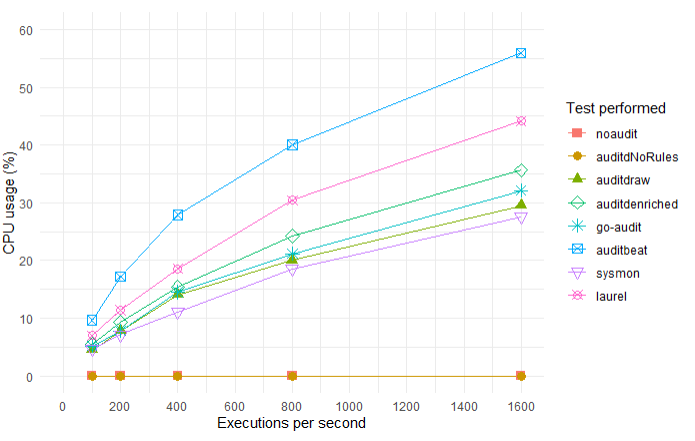
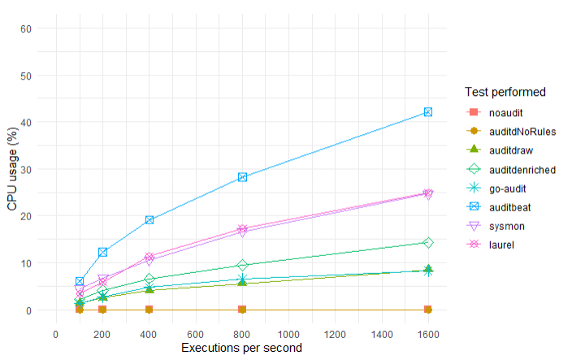

## Introduction

On 19 October 2021, Florian Roth (@cyb3rops)
[tweeted](https://twitter.com/cyb3rops/status/1450366390632910849) a performance graph 
created by Hilko Bengen (@\_hillu) that indicated that Sysmon For Linux had 
abysmal performance, and that he would recommend LAUREL (Hilko's own tool) 
instead. I looked into the bug and discovered a sub-optimal process cache
(thanks for the head's up!), 
which I subsequently fixed. I asked Hilko to rerun the tests with the updated 
version, which he did on
[4 November 2021](https://twitter.com/_hillu/status/1456307261178060802).
This graph still showed Sysmon For 
Linux as sub-par and I was concerned that either we had significant performance 
issues in our filter engine (the other competitors didn't do any filtering), or 
something else might have been wrong with the tests.

Looking at the details on 
[Hilko's site](https://github.com/threathunters-io/laurel/blob/master/performance.md), 
and in conversation on Twitter, I noted that:

* Sysmon For Linux had been running with a configuration file that would have 
enabled process termination events in addition to process creation events, as 
these are on by default. In fact, even if you disable them, they are still 
generated in eBPF and sent to userland, but they are filtered out by the filter 
engine; this is because Sysmon For Linux maintains a process cache (the source 
of the performance bug) in order to improve access time for other event
information.
* Sysmon For Linux was tested on Ubuntu 20.04 whereas the other tools were 
tested on Amazon Linux 2, although all were on the same type of machine, an AWS 
EC2 t2.small instance. I was concerned that the kernel for the Amazon Linux 
instance was v4.14 (which Sysmon For Linux doesn't support) whereas the kernel 
for Ubuntu 20.04 was likely v5.8, as this could impact on the performance 
metrics. In addition, I suspected that the differences in libc versions could 
also cause an impact.

I decided to rerun all the tests in Azure, on a Standard\_B2s, with them all 
running on the same instance of Ubuntu 20.04. The results and approach follow.

## Results



The graph shows that when no audit tool was running, or auditd was running with 
no rules, that no discernable CPU usage was consumed by kauditd, 
systemd-journald, or (in the case of auditd with no rules), auditd.

Further, the results show that Sysmon For Linux is the clear winner! I can only 
assume that the combination of halving the number of events processed and 
output to Syslog (by removing all the process termination events), combined 
with the level playing field, made all the difference. :)

The results, in order of lowest CPU utilisation, were:

1. Sysmon For Linux 1.0.2
2. Auditd 2.8.5 (RAW)
3. Go-Audit dev+20211208153116
4. Auditd 2.8.5 (ENRICHED)
5. LAUREL 0.1.6-pre
6. Auditbeat 7.16.0

## Update!

Hilko got in touch and explained that kaudit/auditd was logging to
systemd-journald as well as its intended target (/var/log/audit or audisp) and
that this was causing the heavy load seen on systemd-journald. He suggested
that a user would not have logging duplicated if they had a dedicated logging
system set up, so it was unreasonable to perform this double logging. After
consultation with Hilko, and a quick Google, I turned off this double logging
for auditd as follows:

```
systemctl stop systemd-journald-audit.socket 
systemctl disable systemd-journald-audit.socket
systemctl mask systemd-journald-audit.socket
systemctl restart systemd-journald
```

That vastly improved the results for everything except Sysmon For Linux. On
investigation, I discovered that for Sysmon For Linux, both syslog *and*
systemd-journald were logging its events! As in, Sysmon For Linux was still
suffering from double logging when all the others were not. I fixed that by
disabling the local logging by systemd-journald, as everything was being 
forwarded to rsyslogd anyway - the same argument applies (I believe) that if
the logs are being forwarded, a user would not want them logged by
systemd-journald as well. I disabled it by setting

```
Storage=none
```

in /etc/systemd/journald.conf. The logs still make it to syslog as intended.

The new graph is as follows:



This new graph shows that with systemd-journald taken out of the equation,
auditd (RAW) and go-audit are the winners, followed by auditd (enriched),
followed by both Sysmon For Linux and Laurel tied, followed by auditbeat.
Given that Sysmon For Linux and Laurel provide much more useful output than
auditd and go-audit, this is to be expected. Note that Sysmon For Linux
provides numerous other rich events (process termination, file, network,
direct block access, and ptrace, with more to come), and advanced filtering,
in addition to rapid event capture via eBPF.

The new results, in order of lowest CPU utilisation, are:

1. Auditd 2.8.5 (RAW)
2. Go-Audit dev+20211208153116
3. Auditd 2.8.5 (ENRICHED)
4. Sysmon For Linux 1.0.2
5. LAUREL 0.1.6-pre
6. Auditbeat 7.16.0

Thanks to Hilko for the recommendations to retest.

## Approach

I wrote my own execPerSec tool in C that would launch a specified number of 
executions of '/bin/true' per second, for a set number of seconds. I installed 
all the tools and opted for default configurations where possible; for 
Auditbeat I configured a file output and disabled all other output. For LAUREL,
I configured Auditd to *not* write to log files itself, as this would have
doubled the i/o. I then 
created scripts, one per tool, that would disable the other tools, sanitise the 
environment, run the tool under test, and run execPerSec at various 
frequencies. I chose 100Hz, 200Hz, 400Hz, 800Hz, and 1600Hz. I monitored all the 
processes in 'top' and determined those that appeared to use CPU. I then 
modified the scripts to sample the CPU usage of all the processes that were
affected, for 30 seconds of activity.

## Notes

Hilko stated on his site that the CPU usage for Sysmon For Linux included 
systemd-journald because it wrote its events via it. In my tests I noted that 
when no audit tool was in use, or auditd was in use with no audit rules, that 
systemd-journald consumed no CPU. But when an audit tool was in use, auditd or 
otherwise, systemd-journald consumed significant amounts of CPU\*. I therefore 
included the amount of CPU used by systemd-journald in all tests. If, as 
implied, the other tools didn't cause systemd-journald to consume any CPU, then 
it wouldn't add anything to the total. If, however, it did, then I thought this 
was important to count.

In addition to including systemd-journald, I also included kauditd for all 
tools using kaudit (all except Sysmon For Linux), included auditd for all those 
using auditd (auditd raw, auditd enriched, and LAUREL), and included audisp for 
LAUREL. (audisp plugins were disabled in all tests other than LAUREL, as none
of the other tools relied upon it.) I also included rsyslogd for Sysmon For
Linux.

Hilko further stated that the CPU usage of the eBPF programs in Sysmon For 
Linux hadn't been counted. This is a tricky thing to calculate (suggestions 
welcomed) so I ran 'perf top' filtered for 'bpf' and manually added the CPU 
usage for the eBPF programs. This ranged from 0.48% at 100Hz to 0.98% at
1600Hz, which appears reasonable considering the small amount of work the eBPF
programs do per event, compared to the volume of work conducted by the userland
process. I would welcome improvements or corrections on how to 
calculate these values. The figures for Sysmon For Linux include the CPU usage
ascribed to the eBPF programs.

Raw data can be found in perf.csv and scripts, programs, and configuration
files can be found in the tests directory.

\* This was true of the first round of tests. See 'Update' above.

