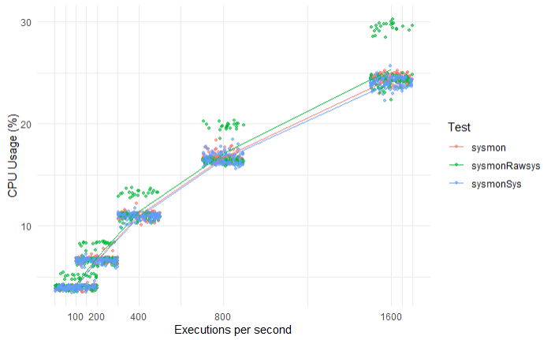

# Tracepoint Comparisons

## Introduction

As explained in the documentation, there are three ways of attaching to syscall
tracepoints:

* Connect as raw tracepoint to raw\_syscalls tracepoints on enter and exit of
entire syscall architecture. This is what Sysmon For Linux does.
* Connect as traditional tracepoint to raw\_syscalls tracepoints.
* Connect to individual traditional tracepoints on enter and exit of each
syscall.

Sysmon For Linux connects to raw tracepoints as eBPF documentation implied
that this would provide better performance.

## Results

The graph shows that the performance of the three approaches are very similar.
Statistical analysis (a robust linear regression model with planned contrasts)
revealed that the differences between them were not statistically significant.

Raw data is in perfSysmon.csv.

